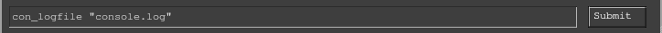
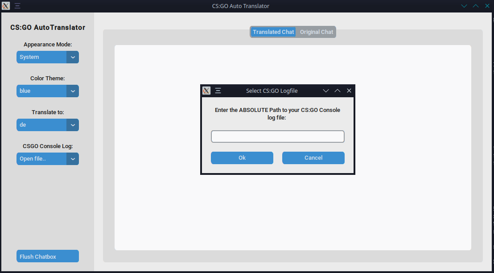

# CSGO Chat Autotranslator

## Motivation
Have you ever played matchmaking and ended up copy&pasting chat messages just so you can understand what your teammates or players in the enemy team are saying?
This software reads the console log output of CS:GO and trys to filter out chat-messages. It then sends those to google translate, along with a desired output language.
You are then left with a translated message, much the same as if you just copied it into google translate manually. This is just much more convienient and saves you some 
annoying clicks.

## Usage

### Prepare your CS:GO Installation
This software reads the console log output of csgo, which can be written to a seperate file using the console command `con_logfile "<filename>"`. 

The file then lives inside the directory, in which CS:GO is installed. You need the absolute path to access it. Currently whitespaces inside the path
must not be escaped.

### Using CS:GO ATT
When you first launch the App, you will see this Window:

This represents the default state of the App. It asks you to input your csgo console log file as described above. Once you have entered the path, csgoatt will remember it
and try to open the same file the next time you launch the app.

## Important Notes

1. All persistant settings and last-used values are stored in `$HOME/.csgoatt.appstate` as a json string.
2. If this file does not exist, you will simply be asked to input the path to your console log file again. csgoatt will write to the aforementioned file when closing the App.

## Dependencies

1. [customtkinter](https://github.com/TomSchimansky/CustomTkinter)
2. [tkinter](https://docs.python.org/3/library/tkinter.html)
3. [googletrans](https://pypi.org/project/googletrans/)

## Disclaimer
Although the developer of this software does not see any risk of getting VAC banned for using this software, there is no guarantee. If you get VAC banned for using this software
be aware of this disclaimer. The developer cannot be held accountable if your account gets VAC banned. Use at your own risk.